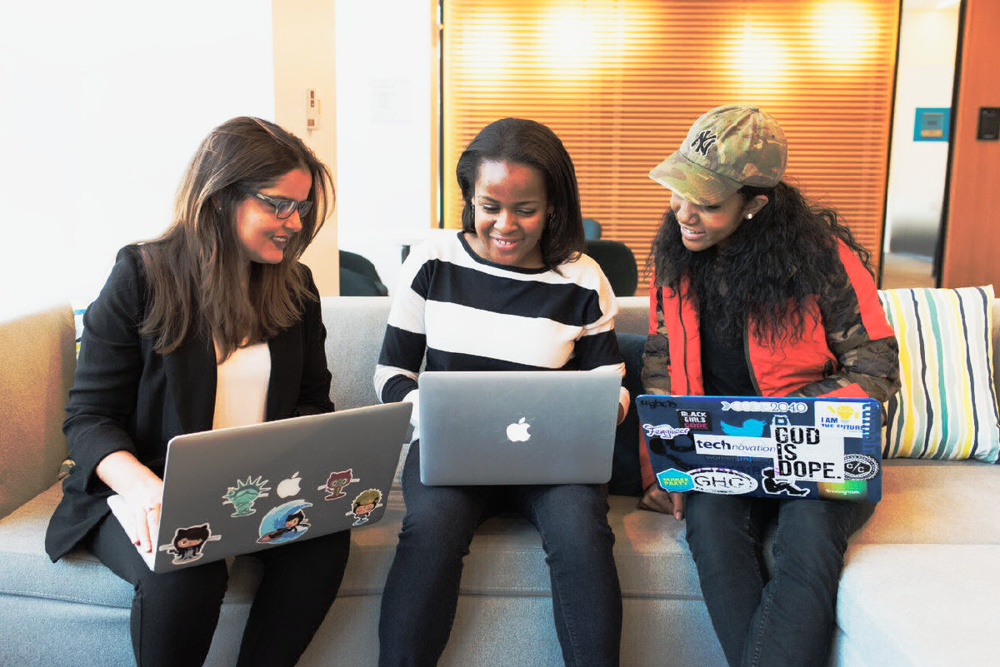
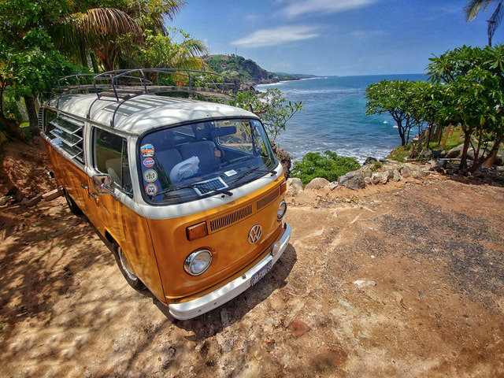
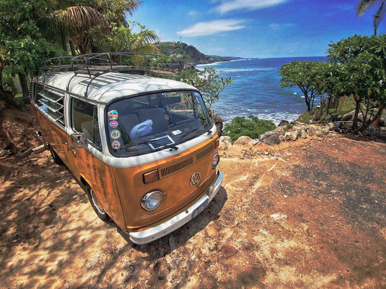
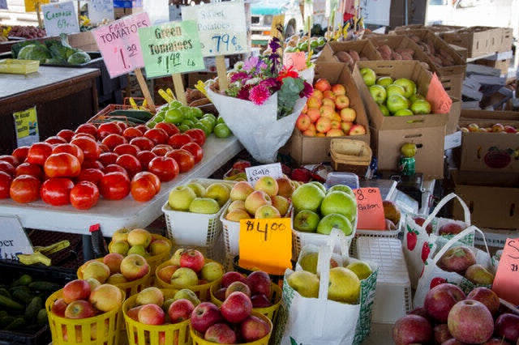
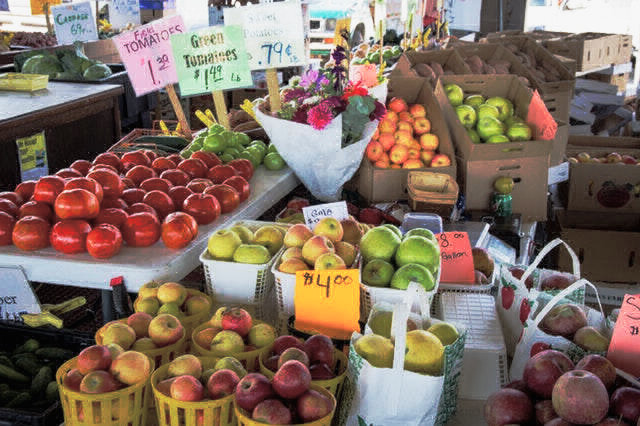

# Sample results

Real before/after output from the Alexa Look pipeline, run on real free-license
photos and one free-license video clip — not mockups or hand-tweaked images.

## What the look does

The look is a 3D LUT derived entirely from published, generic camera
color-science constants — no ARRI-authored asset is used or shipped (see the
[main README](../README.md#how-the-look-is-derived--and-what-it-is-not) for
the full derivation). In short, each pixel is:

1. Linearized (sRGB/Rec.709 EOTF) and converted into ALEXA Wide Gamut.
2. Encoded to **LogC3** (EI800).
3. Run through an original **filmic S-curve** — a gentle shadow toe, healthy
   mid-tone contrast, and a soft highlight roll-off — then given a mild,
   luma-weighted **desaturation** (heavier at the tonal extremes).
4. Converted back to Rec.709/sRGB and clamped.

## How these images were actually produced

Every image below was generated by the app's real processing code, not a
preview or an approximation of it:

- **Photos** were graded by [`tool/apply_look.dart`](../tool/apply_look.dart),
  a pure-Dart CLI added alongside this doc. It calls the exact same
  functions the app calls at runtime —
  [`CubeLut.parse`](../lib/core/cube_lut.dart) on the committed
  [`assets/luts/alexa_look_33.cube`](../assets/luts/alexa_look_33.cube), the
  same [`capToMaxDimension`](../lib/core/image_cap.dart) resize helper, and
  [`CubeLut.applyLutToRgbaBand`](../lib/core/cube_lut.dart) — the identical
  bulk trilinear-interpolation + intensity-blend applier the app's multicore
  photo grading (`gradeRgbaMulticore`) fans out across isolates. Every
  "after" image here was graded at intensity **1.0**; every "before" image
  ran through the identical decode → orientation-bake → resize → encode path
  with intensity **0.0** (no color change), so the only difference between
  the two is the grade itself. Sources were capped to 1200px on the long
  edge before grading, saved as quality-85 JPEG.
- **Video** was graded with `ffmpeg`'s `lut3d` filter pointed at the same
  committed `.cube` file, the same way
  [`lib/features/video/video_processor.dart`](../lib/features/video/video_processor.dart)
  invokes it in the app (`-vf lut3d=<path>[,scale=W:H] -pix_fmt yuv420p
  -movflags +faststart`). The "before" clip was re-encoded with the identical
  ffmpeg settings minus the `lut3d` filter, so compression is comparable
  between the two.

## A note on sources

The task for this showcase called for CC0/public-domain photos from sites
like Wikimedia Commons or picsum.photos. This sandbox's network egress is
locked down to GitHub only (`github.com` / `raw.githubusercontent.com` and a
handful of package registries) — Wikimedia, Pexels, Pixabay, and every other
image host are blocked at the proxy level. So instead, every source below is
a **real CC0-licensed photo (or CC0 video) that another open-source project
already committed to a public GitHub repo**, most with an explicit
`CC0-1.0`-tagged metadata sidecar bundled right next to the image file. Each
entry cites both the original Pexels photo/video page **and** the exact
GitHub repo, path, and commit the file was pulled from, so the chain of
provenance is checkable.

## Photos

### 1. Portrait — skin tones

<table>
<tr><th>Before</th><th>After</th></tr>
<tr>
<td></td>
<td></td>
</tr>
</table>

*"Three Woman in Front of Laptop Computer"* by
[Christina Morillo](https://www.pexels.com/@divinetechygirl), source:
[pexels.com/photo/three-woman-in-front-of-laptop-computer-1181233](https://www.pexels.com/photo/three-woman-in-front-of-laptop-computer-1181233/) —
**License: CC0 1.0** (Pexels "No Copyright" dedication). Pulled from
[`peterlembke/infohub-articles`](https://github.com/peterlembke/infohub-articles),
`generic-image/pexels-christina-morillo-1181233.jpg` @
[`8392c41`](https://github.com/peterlembke/infohub-articles/blob/8392c41d0d03ad8eba70549f675b4ca77bd84acb/generic-image/pexels-christina-morillo-1181233.json)
(the commit's own bundled `.json` sidecar records `"license_name": "CC0-1.0"`).

### 2. Landscape / nature

<table>
<tr><th>Before</th><th>After</th></tr>
<tr>
<td></td>
<td></td>
</tr>
</table>

*"Usage"* (a VW camper van above a tropical coastline) by
[Alfonso Escalante](https://www.pexels.com/sv-se/@alfonso-escalante-1319242),
source:
[pexels.com/.../strand-hav-sommar-vintage-2607724](https://www.pexels.com/sv-se/foto/strand-hav-sommar-vintage-2607724/) —
**License: CC0 1.0**. Pulled from
[`peterlembke/infohub`](https://github.com/peterlembke/infohub),
`folder/plugins/infohub/welcome/asset/image/youcan/usage.jpeg` @
[`bdd5f03`](https://github.com/peterlembke/infohub/blob/bdd5f0314869680fea21b111adac66d59afc440d/folder/plugins/infohub/welcome/asset/image/youcan/usage.json).

### 3. City / street

<table>
<tr><th>Before</th><th>After</th></tr>
<tr>
<td></td>
<td></td>
</tr>
</table>

*"Expence"* (an outdoor farmers-market produce stall) by
[John Lambeth](https://www.pexels.com/sv-se/@john-lambeth-1182693), source:
[pexels.com/.../affar-alternativ-applen-bas-2255903](https://www.pexels.com/sv-se/foto/affar-alternativ-applen-bas-2255903/) —
**License: CC0 1.0**. Pulled from
[`peterlembke/infohub`](https://github.com/peterlembke/infohub),
`folder/plugins/infohub/welcome/asset/image/youcan/expence.jpeg` @
[`bdd5f03`](https://github.com/peterlembke/infohub/blob/bdd5f0314869680fea21b111adac66d59afc440d/folder/plugins/infohub/welcome/asset/image/youcan/expence.json).

### 4. Dusk / mood (sky & shadow gradient)

<table>
<tr><th>Before</th><th>After</th></tr>
<tr>
<td></td>
<td></td>
</tr>
</table>

*"Silhouette of women on lake against sky"* by
[Pixabay](https://www.pexels.com/@pixabay), source:
[pexels.com/photo/silhouette-of-women-on-lake-against-sky-248139](https://www.pexels.com/photo/silhouette-of-women-on-lake-against-sky-248139/) —
**License: CC0 1.0**. Pulled from
[`peterlembke/infohub`](https://github.com/peterlembke/infohub),
`folder/plugins/infohub/welcome/asset/image/youcan/body.jpeg` @
[`bdd5f03`](https://github.com/peterlembke/infohub/blob/bdd5f0314869680fea21b111adac66d59afc440d/folder/plugins/infohub/welcome/asset/image/youcan/body.json).
Chosen specifically to show the grade's shadow toe and highlight roll-off
across a wide sky gradient — the closest thing to a "night scene" available
under the sourcing constraints above.

## Video

A 5-second, 1280×720 clip, graded with `ffmpeg`'s `lut3d` filter exactly as
described above.

<table>
<tr><th>Before</th><th>After</th></tr>
<tr>
<td></td>
<td></td>
</tr>
</table>

Full clips: [`samples/video_before.mp4`](samples/video_before.mp4) ·
[`samples/video_after.mp4`](samples/video_after.mp4)

Source: *"Video.mp4"*, a laptop-typing clip bundled as
[`Cyclenerd/gallery_shell`](https://github.com/Cyclenerd/gallery_shell)'s
demo video, `images/demo/Video.mp4` @
[`ec79820`](https://github.com/Cyclenerd/gallery_shell/blob/ec798205b9f3a35fe72ce010a763412fcd013f05/images/demo/Video.mp4) —
**License: CC0** per the repo's own
[`images/demo/Example_video_LICENSE.txt`](https://github.com/Cyclenerd/gallery_shell/blob/ec798205b9f3a35fe72ce010a763412fcd013f05/images/demo/Example_video_LICENSE.txt):
*"Pexels Videos offers completely free videos. All videos are licensed under
the Creative Commons Zero (CC0) license."* The specific original Pexels
video-page URL wasn't preserved by that repo, only its CC0 attestation.
The showcase clip here is a 5-second excerpt (`-ss 1 -t 5`) of the full
~9-second source, re-encoded to 1280×720 H.264 for both before and after so
compression is comparable.

## Reproducing these yourself

```bash
# Photos (before = intensity 0.0, after = intensity 1.0)
dart run tool/apply_look.dart <in.jpg> <out_before.jpg> 0.0
dart run tool/apply_look.dart <in.jpg> <out_after.jpg> 1.0

# Video, mirroring the app's ffmpeg compat path
ffmpeg -i <in.mp4> -vf "lut3d=assets/luts/alexa_look_33.cube,scale=1280:720" \
  -pix_fmt yuv420p -movflags +faststart <out_after.mp4>
```
